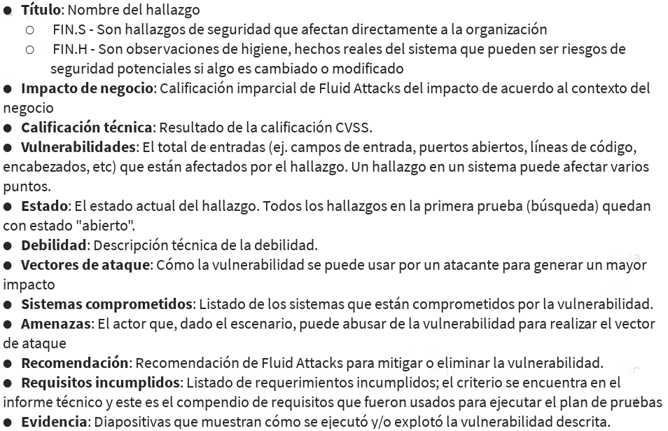
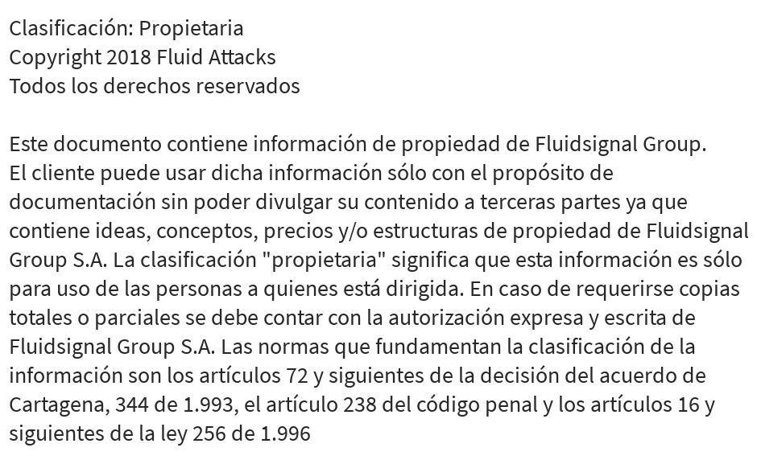

= {{cliente}}: {{toe.upper()}}
:lang:		es
:author:	Para uso exclusivo de {{cliente}}
:email:		engineering@fluidattacks.com
:date: 	    2018-27-02
:revnumber:	{{simpledate}}

<<<
image::../resources/presentation_theme/t_contenido_es.png[width=400]
{nbsp} +

image::../resources/presentation_theme/c_contenido_es.png[pdfwidth=100%, align="center"]

<<<
image::../resources/presentation_theme/t_objetivos_es.png[width=400]
{nbsp} +

image::../resources/presentation_theme/c_objetivos_es.png[pdfwidth=100%, align="center"]

<<<
image::../resources/presentation_theme/t_metodologia_es.png[width=400]
image::../resources/presentation_theme/c_metodologia_es.png[pdfwidth=95%, align="center"]

<<<
image::../resources/presentation_theme/t_criticidad_es.png[width=400]
{nbsp} +

image::../resources/presentation_theme/c_criticidad_es.png[pdfwidth=90%, align="center"]

<<<
image::../resources/presentation_theme/t_alcance_es.png[width=400]

[.center, %header,cols=2*,width="80%",frame="all"]
|===
^|*Parámetro*
^|*Valor*

|*Tipo de prueba*
|{{tipo_prueba}}

|*Fecha de inicio*
|{{fecha_inicio}}

|*Fecha de fin*
|{{fecha_fin}}

|*Alcance posible*
| {{toe_campos_visibles}} entradas/{{toe_puertos_visibles}} puertos/{{toe_lineas_visibles}} líneas  - 

|*Alcance probado*
|{{toe_campos_probados}} entradas/{{toe_puertos_probados}} puertos/{{toe_lineas_probadas}} líneas

|*Cobertura*
|{{tipo_cobertura}}

|*Ambiente*
|{{ambiente}}

|*Cambios en el ambiente*
|{{cambios_ambiente}}

|*Insumos*
|{{insumos}}
|===

[cols=3*]
|===
3+^.^|*{{resume_top_title}}*

^|*Security Tester* ^|*Security Architect* ^|*Project Manager*
^|{{analista}} ^|{{arquitecto}} ^|{{lider}}

|===

<<<
image::../resources/presentation_theme/t_panorama_es.png[width=400]

{{main_pie_filename}}

[cols=4,.center]
|===
4+^.^|*{{resume_ttab_title}}*
|*{{criticity_title}}*|*{{finding_title}}s*|*{{resume_perc_title}}*|*{{resume_vuln_title}}*

  
    {{"| "+col|string}}
  

|===
<<<

image::../resources/presentation_theme/t_panorama_es.png[width=400]

[cols=4,.center]
|===
4+^.^|*{{resume_top_title}}*
^.^|*#* ^|*{{criticity_title}}*
2+^.^|*{{resume_vname_title}}*

	
		{{"2+<.^|"+row[i]|string}}{{"^.^|"+row[i]|string}}
	

^.^|{{"*"+records_title+"*"}} 3+^.^| {{main_tables['num_reg']}}
^.^|*Impactos Relevantes* 3+^.^|{{impacto_relevate}}
|===

<<<

[cols=5,.center]
|===
5+^.^|*Estado Hallazgos*
|*{{finding_title}}* |*{{criticity_title}}* |*{{cardinality_title}}* |*{{state_title}}* |*{{treatment_title}}*

    {{"| "+fin['hallazgo']}}
    {{"| "+fin['criticidad']}}
    {{"| "+fin['cardinalidad']}}
    {{"| "+fin['estado']+"\n"}}
    {{"| "+fin['tratamiento']+"\n"}}

|===

<<<

<<<

{nbsp} +

{{mapa_hallazgos}}

<<<
{nbsp} +
{nbsp} +
{nbsp} +
{nbsp} +
{nbsp} +
[.center]
image::../resources/presentation_theme/findings_es.png[pdfwidth=100%, pdfheight=100%]

<<<

//image::../resources/presentation_theme/t_hallazgo_es.png[width=400]
////
	BEGIN: DOCUMENT BLOCK FOR EVIDENCE
////
== {{findings[i]['hallazgo']}}
=== *_(Criticidad Técnica: {{findings[i]['criticidad']}})_*
{nbsp} +

[cols=4,.center]
|===
<.^|*Vulnerabilidades*
^.^|{{findings[i]['cardinalidad']}}
<.^|*Estado*
^| {{findings[i]['estado']}}

<.^|*Impacto a negocio* ^.^| {{findings[i]['impacto']}} <.^|*Registros comprometidos* ^.^| {{findings[i]['registros_num']}}
<.^|*Debilidad*
3+.^|{{findings[i]['vulnerabilidad']}}
<.^|*Vector de ataque*
3+.^|{{findings[i]['vector_ataque']}}
<.^|*Amenaza*
3+.^|{{findings[i]['amenaza']}}
<.^|*Sistema comprometido*
3+.^|{{findings[i]['sistema_comprometido']}}
<.^|*Recomendación*
3+.^|{{findings[i]['solucion_efecto']}}
<.^|*Requisitos*
3+.^|{{req + "\n"}}
|===

<<<
image::../resources/presentation_theme/t_evidencia_es.png[width=400]


{{evi['explicacion'] + "\n"}}
{{evi['name']+"\n"}}
<<<

////
	END: DOCUMENT BLOCK FOR EVIDENCE
////
<<<


<<<

{nbsp} +

{{observaciones}}

<<<
image::../resources/presentation_theme/t_recomendaciones_es.png[width=400]
{nbsp} +

{{recomendaciones}}

<<<
image::../resources/presentation_theme/t_conclusiones_es.png[width=400]
{nbsp} +

{{conclusiones}}

<<<

{nbsp} +

[.text-center]
Por lo tanto se puede concluir que *{{proyecto_cliente}}* presenta un nivel de seguridad

{{nivel_seguridad}}

[.text-center]
Criticidad más alta *{{findings[0]["impacto"]}}* y vector de acceso mas riesgoso *{{findings[0]["vector_acceso"].split(" | ")[1].split(":")[0]}}*

<<<
image::../resources/presentation_theme/t_contacto_es.png[width=400]
{nbsp} +

image::../resources/presentation_theme/c_contacto_es.png[pdfwidth=80%, align="center"]

<<<
image::../resources/presentation_theme/t_clausula_es.png[width=400]
{nbsp} +

<<<
{nbsp} +
{nbsp} +

image::../resources/presentation_theme/end.png[pdfwidth=50%, align="center"]
