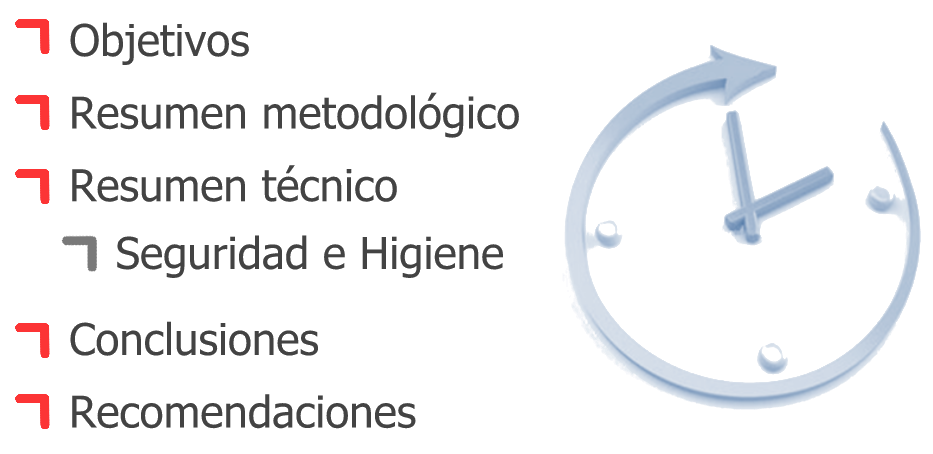
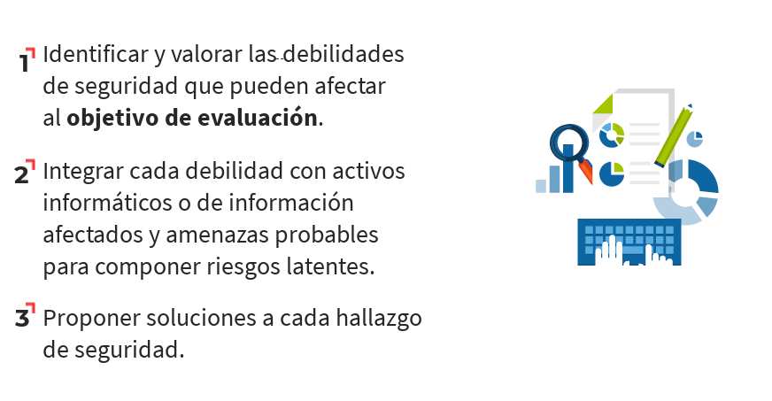
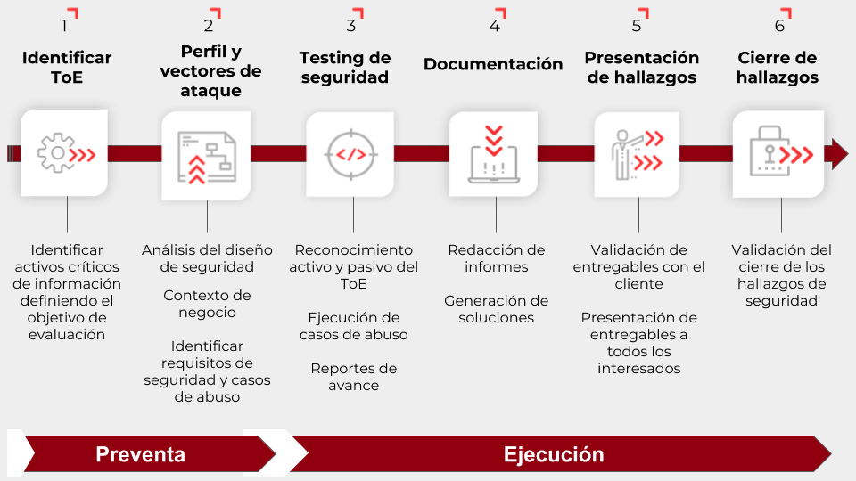
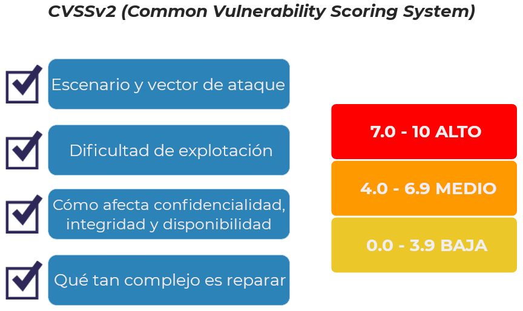
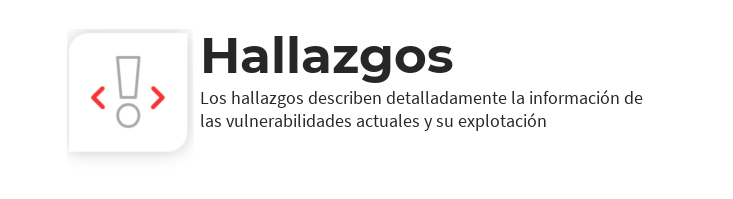
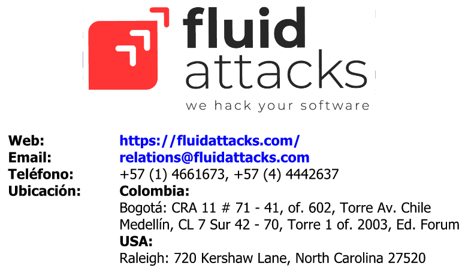
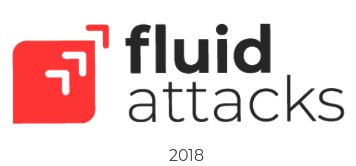

= {{toe}}: {{tipo_prueba}}
:lang:		es
:author:	Para uso exclusivo de {{cliente}}
:email:		engineering@fluid.la
:date: 	    2018-11-01
:revnumber:	{{simpledate}}

<<<

{nbsp} +

<<<

{nbsp} +

<<<

<<<

{nbsp} +

<<<

[.center, %header,cols=2*,width="80%",frame="all"]
|===
^|*Parámetro*
^|*Valor*

|*Fecha de inicio*
|{{fecha_inicio}}

|*Fecha de fin*
|{{fecha_fin}}

|*Alcance posible*
| {{toe_campos_visibles}} entradas/{{toe_puertos_visibles}} puertos/{{toe_lineas_visibles}} líneas  - 

|*Alcance probado*
|{{toe_campos_probados}} entradas/{{toe_puertos_probados}} puertos/{{toe_lineas_probadas}} líneas

|*Cobertura*
|{{tipo_cobertura}}

|*Ambiente*
|{{ambiente}}

|*Cambios en el ambiente*
|{{cambios_ambiente}}

|*Insumos*
|{{insumos}}
|===

[cols=3*]
|===
^|*Security Tester*
^|*Security Architect*
^|*Project Manager*

^| {{analista}} 
^| {{arquitecto}} 
^| {{lider}}

3.3+^| *Equipo del proyecto*
|===

<<<

{{main_pie_filename}}
.{{resume_ttab_title}}
[cols="^,^,^,^", options="header"]
|===
|{{criticity_title}}|{{finding_title}}s|{{resume_perc_title}}|{{resume_vuln_title}}

  
    {{"| "+col|string}}
  

|===
<<<

[cols=4,.center]
|===
4+^.^|*{{resume_top_title}}*
^.^|*#* ^|*{{criticity_title}}* 
2+^.^|*{{resume_vname_title}}*

	
		{{"2+<.^|"+row[i]|string}}{{"^.^|"+row[i]|string}}
	

^.^|{{"*"+records_title+"*"}} 3+^.^| {{main_tables['num_reg']}}
^.^|*Impactos Relevantes* 3+^.^|{{impacto_relevate}}
|===

<<<
{nbsp} +
{nbsp} +
{nbsp} +
{nbsp} +
{nbsp} +
[.center]

																																																																											
<<<


////
	BEGIN: DOCUMENT BLOCK FOR EVIDENCE
////
[cols=4,.center]
|===
4+^.^|*{{findings[i]['hallazgo']}}*

^.^|*#* ^| {{(i+1)|string}} ^.^|*Criticidad* ^.^| {{findings[i]['criticidad']}}
^.^|*Vulnerabilidades* ^.^| {{findings[i]['cardinalidad']}} ^.^|*Estado* ^| {{findings[i]['estado']}}
^.^|*Impacto a negocio* ^.^| {{findings[i]['impacto']}} ^.^|*Registros comprometidos* ^.^| {{findings[i]['registros_num']}}
^.^|*Debilidad*
3+.^|{{findings[i]['vulnerabilidad']}}
^.^|*Vectores de ataque*
3+.^|{{findings[i]['vector_ataque']}}
^.^|*Amenazas*
3+.^|{{findings[i]['amenaza']}}
^.^|*Sistema comprometido*
3+.^|{{findings[i]['sistema_comprometido']}}
^.^|*Recomendación*
3+.^|{{findings[i]['solucion_efecto']}}
^.^|*Requisitos incumplidos*
3+.^|{{req + "\n"}}
|===

<<<


{{evi['explicacion'] + "\n"}}
{{evi['name']+"\n"}}
<<<

////
	END: DOCUMENT BLOCK FOR EVIDENCE
////
<<<


<<<

{nbsp} +

{{observaciones}}

<<<

{nbsp} +

{{conclusiones}}

<<<

{nbsp} +

<<<

{nbsp} +
{nbsp} +

===== Clasificación: Propietaria
===== Copyright © 2018 FLUID
===== Todos los derechos reservados.
===== Este documento contiene información de propiedad de FLUID. El cliente puede usar dicha información sólo con el propósito de documentación sin poder divulgar su contenido a terceras partes ya que contiene ideas, conceptos, precios y estructuras de propiedad de FLUID La clasificación "propietaria" significa que ésta información es sólo para uso de las personas a quienes esta dirigida. En caso de requerirse copias totales o parciales se debe contar con la autorización expresa y escrita de FLUID Las normas que fundamentan la clasificación de la información son los artículos 72 y siguientes de la decisión del acuerdo de Cartagena, 344 de 1.993, el artículo 238 del código penal y los artículos 16 y siguientes de la ley 256 de 1.996. 

<<<
{nbsp} +
{nbsp} +

